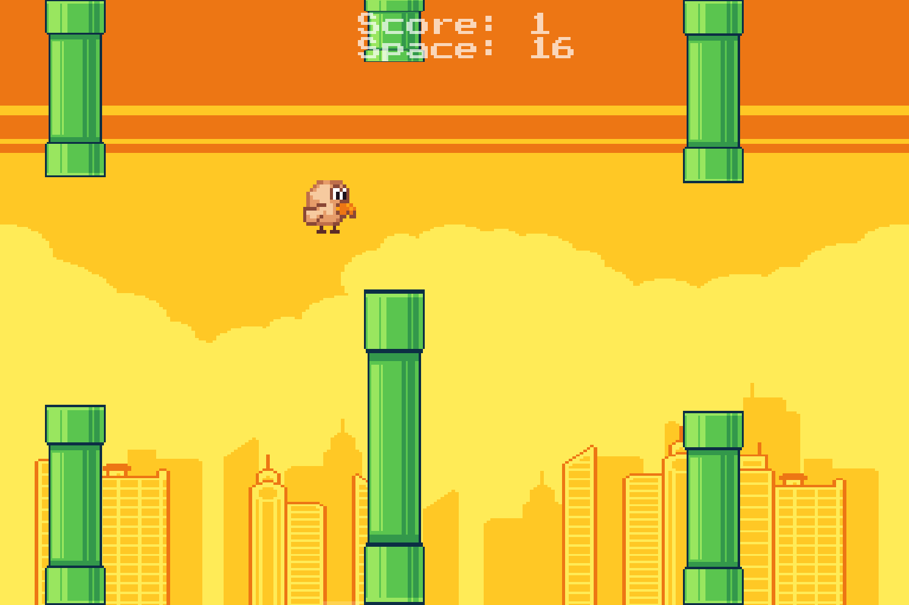
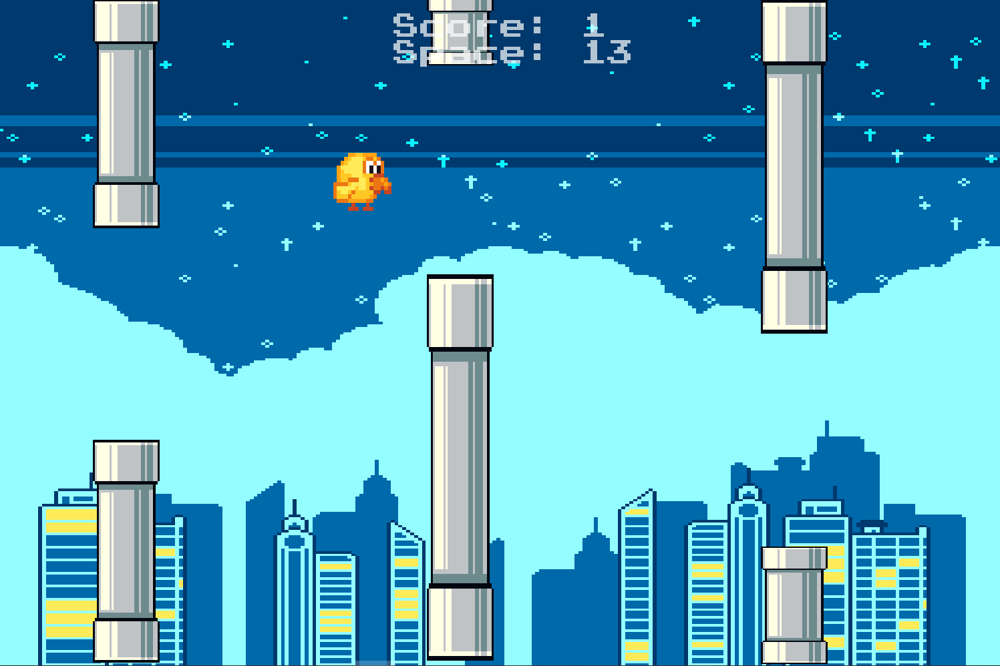
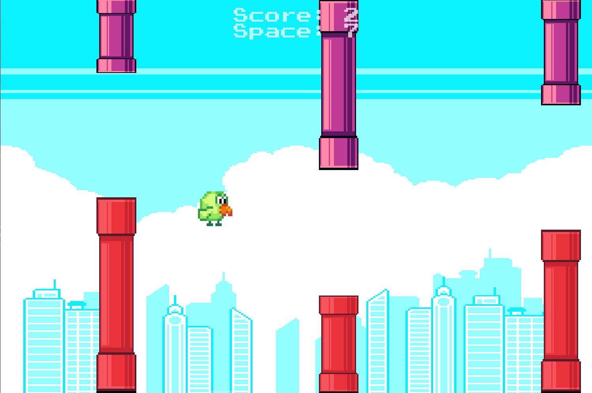

# Flappy Bird Clone (Java)

## Introduction and Motivation
A Java implementation of the classic Flappy Bird game with configurable difficulty levels and data persistence. This project explores object-oriented programming concepts, database management, and interactive GUI development.

## Theoretical Foundations
- **Object-Oriented Programming**: Implementation of Bird, Pipe, and Game Engine classes
- **Java Swing GUI**: Using Java Swing library for graphical interface
- **MySQL Database**: Score and configuration persistence
- **Design Patterns**: Observer pattern for event handling
- **Game Physics**: Collision detection and gravity simulation

## Problem Description
Development of a customized Flappy Bird version featuring three configurable difficulty levels, persistent scoring system, and responsive graphical interface. The challenge lies in balancing difficulty progression and implementing smooth gameplay mechanics.

## Proposed Solution
The application uses MVC (Model-View-Controller) architecture to separate game logic, graphical interface, and data management. The difficulty system dynamically adjusts game parameters (speed, gap size, physics) to create distinct gameplay experiences.

## Application Overview

### Architecture
- **Model**: Game state management, physics calculations, collision detection
- **View**: Java Swing components for rendering game graphics
- **Controller**: Input handling and game flow coordination

### Data Management
- **MySQL Database**: Persistent storage for high scores and player statistics
- **Configuration Files**: Game settings and difficulty parameters
- **Real-time State**: In-memory game object tracking

### Data Representation
- Game objects represented as Java classes with position, velocity, and state properties
- Database schema with tables for scores, players, and game sessions
- JSON-like configuration structure for difficulty settings

### Usage
1. Launch application and select difficulty level
2. Use spacebar to control bird flight
3. Navigate through pipe obstacles
4. Scores automatically saved to database

## Features
- **Three Difficulty Modes**:
  - 🟢 **Easy**: Slower pipes, larger gaps, forgiving physics
  - 🟡 **Medium**: Balanced challenge (classic Flappy Bird experience)
  - 🔴 **Hard**: Lightning-fast pipes, narrow gaps, precise timing required
- Simple one-button controls (spacebar/tap)
- Score tracking with high score persistence
- Responsive gameplay with smooth animations

## Installation & Running
### Requirements
- Java JDK 11 or higher
- MySQL Server

### Setup
1. Import the .sql file into MySQL Workbench
2. Configure database connection in application properties
3. Compile and run the Main class

### Test Data & Results
- Performance testing across all difficulty levels
- Score validation and persistence verification
- Collision detection accuracy testing

## Conclusions
The project successfully implements a scalable Flappy Bird clone with configurable difficulty and persistent data storage. The MVC architecture ensures maintainable code, while the MySQL integration provides reliable score tracking. Future enhancements could include multiplayer support and additional game modes.
